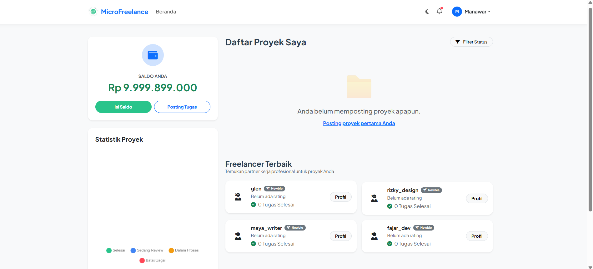
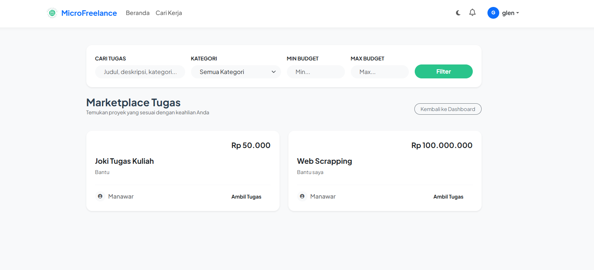
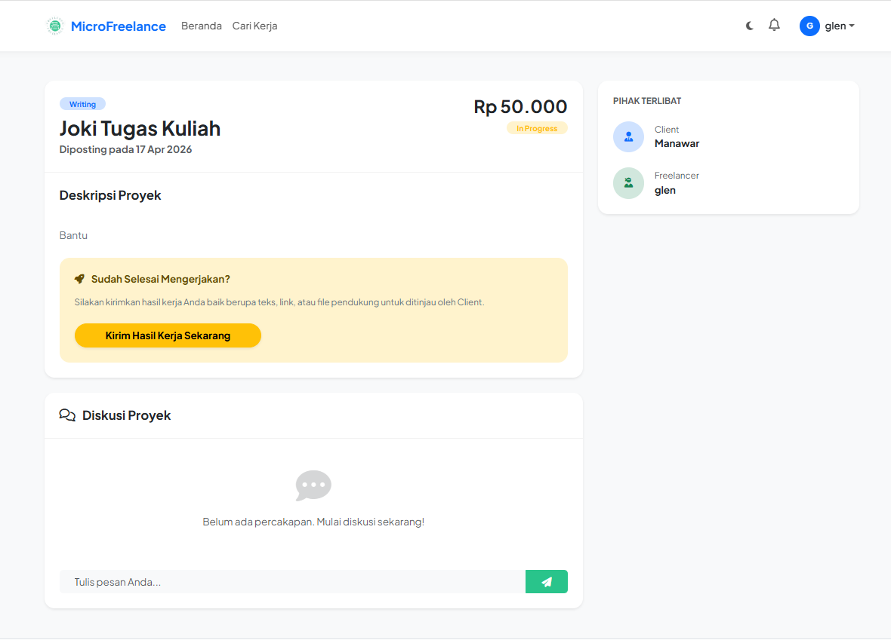
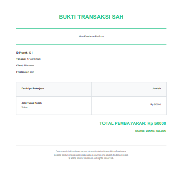

# 🚀 MicroFreelance Platform

**MicroFreelance** adalah platform marketplace freelance sederhana yang menghubungkan **Client** (pemberi kerja) dan **Freelancer** (pekerja lepas). Proyek ini dibangun menggunakan **Django Framework** dengan fokus pada integritas data transaksi dan pengalaman pengguna yang intuitif.

---

## 📸 Screenshots Dokumentasi

> **Catatan:** Masukkan screenshot aplikasi Anda ke folder `screenshots/` agar muncul di sini.

| Dashboard Client | Browse Projects |
| :---: | :---: |
|  |  |

| Project Detail & Chat | Invoice PDF |
| :---: | :---: |
|  |  |

---

## ✨ Fitur Utama

### 🛠️ Bagi Client
- **Post Project**: Membuat tugas baru dengan kategori dan budget tertentu.
- **Talent Scouting**: Melihat daftar freelancer terbaik berdasarkan rating.
- **Project Management**: Memantau status proyek (Open, In Progress, Review).
- **Payment Approval**: Menyetujui hasil kerja dan melakukan pembayaran otomatis.
- **Download Invoice**: Mendapatkan bukti pembayaran dalam format PDF.

### 💼 Bagi Freelancer
- **Browse Projects**: Mencari tugas dengan fitur filter (kategori & budget).
- **Submit Work**: Mengirimkan hasil kerja berupa teks atau file dokumen.
- **Wallet System**: Melihat saldo pendapatan dan melakukan permintaan penarikan (Withdrawal).
- **Professional Profile**: Menampilkan portofolio proyek yang telah diselesaikan.

### 🛡️ Fitur Sistem (Core)
- **Activity Log**: Mencatat setiap aktivitas user demi keamanan (Middleware).
- **Real-time Notifications**: Pemberitahuan otomatis saat status proyek berubah (Signals).
- **REST API**: Endpoint API untuk integrasi data di masa depan (Django REST Framework).

---

## 🛠️ Tech Stack

- **Backend**: Python 3.x, Django 5.x
- **Database**: SQLite3 (Development)
- **API**: Django REST Framework (DRF)
- **PDF Engine**: xhtml2pdf
- **UI/UX**: Bootstrap 5, FontAwesome, Google Fonts
- **Monitoring**: Custom Middleware for Activity Logging

---

## 🚀 Cara Instalasi (Local Development)

1. **Clone Repository**
   ```bash
   git clone https://github.com/glendery/MicroFreelance.git
   cd MicroFreelance
   ```

2. **Buat Virtual Environment**
   ```bash
   python -m venv venv
   source venv/bin/activate  # Linux/Mac
   venv\Scripts\activate     # Windows
   ```

3. **Install Dependencies**
   ```bash
   pip install -r requirements.txt
   ```

4. **Konfigurasi Environment**
   Buat file `.env` di root folder dan isi:
   ```env
   DEBUG=True
   SECRET_KEY=ganti-dengan-key-rahasia-anda
   ALLOWED_HOSTS=localhost,127.0.0.1
   ```

5. **Migrasi Database & Seed Data**
   ```bash
   python manage.py migrate
   python seed_data.py
   ```

6. **Jalankan Server**
   ```bash
   python manage.py runserver
   ```
   Akses di: `http://127.0.0.1:8000/`

---

## 👥 Akun Demo (Simulasi)

| Role | Username | Password |
| :--- | :--- | :--- |
| **Admin** | `admin` | `admin123` |
| **Client** | `pak_bambang` | `pass123` |
| **Freelancer** | `rizky_design` | `pass123` |

---

## 📄 Lisensi
Proyek ini dibuat untuk keperluan Tugas Akhir Matakuliah Pemrograman Lanjut.

---
*Dibuat dengan ❤️ oleh [Glendery](https://github.com/glendery)*
